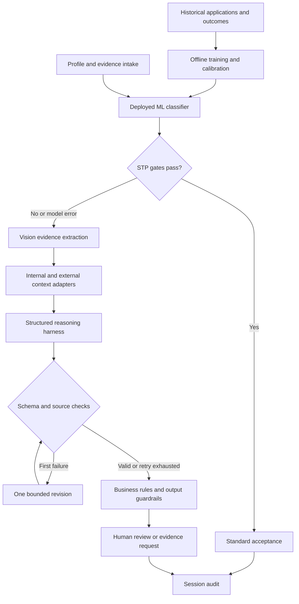

# Hybrid Life & Medical Underwriting Demo

An interactive underwriting studio with two execution modes: a fully synthetic mock demonstration, and real testing against your local ML / Vision LLM / retrieval APIs. The UI exposes each assessment step, its structured output, the final explanation, supporting source IDs and the human decision.

## Quick start

### Mock demonstration

Open the privately hosted Site, or run the local runner below and choose **Mock AI demo**. No model is required. Six selectable synthetic profiles cover standard life, standard medical, substandard, missing evidence, out-of-distribution and ML-service failure cases. Demographics and declarations can be edited. Mock mode uses scripted AI outputs and generated fictional evidence; it never reads uploaded document content.

### Local API testing

Python 3.10+ and a Vision LLM server with OpenAI-compatible `POST /v1/chat/completions` and image inputs are required. Node 18+ is only needed for JavaScript tests.

```sh
python -m venv .venv
# macOS / Linux:
source .venv/bin/activate
# Windows PowerShell instead: .venv\Scripts\Activate.ps1
pip install -r requirements.txt
export UW_LLM_BASE_URL=http://localhost:8000/v1
export UW_LLM_MODEL=your-vision-model
# Set UW_LLM_API_KEY if your server requires it.
python server.py
```

Open `http://127.0.0.1:8080` and choose **Local API testing**. In PowerShell, set variables with `$env:UW_LLM_MODEL="your-vision-model"` and the corresponding base URL variable. No keys belong in frontend code.

The hosted Site is a static mock demo. It cannot run the Python backend or directly reach an on-premise model. For real testing, run this same UI locally. Local mode on the hosted page stops with setup instructions; it never substitutes mock results.

## Hybrid architecture



ML training is **not included**: there is no historical dataset or trained model in this repository. Connect your own validated deployed model. In mock mode, model confidence and classifications are scripted, not calibrated measurements.

STP requires an available model, standard class, explicit calibration flag, confidence ≥ 0.95, OOD=false, evidence completeness tied to uploaded document hashes, and all business rules passing. Illustrative referral rules cover age >75, life cover >SGD 1m, smoking and declared conditions. Demographics are editable and passed to the local model; the demo does not claim fairness validation or permit use as a production underwriting policy.

Missing ML integration or an ML service error enters the complex path. Missing evidence blocks acceptance. Complex-path model outputs are recommendations; approval, revised terms, postponement or decline require a recorded human decision. No policy is issued.

## Model and data adapters

All endpoint URLs are supplied by the operator through environment variables. The UI cannot set arbitrary proxy targets.

| Variable | Purpose |
|---|---|
| `UW_LLM_BASE_URL` | Vision-capable OpenAI-compatible base URL, including `/v1` |
| `UW_LLM_MODEL` | Exact model name served by your endpoint |
| `UW_LLM_API_KEY` | Optional LLM bearer token |
| `UW_ML_URL` | Optional full HTTP prediction endpoint |
| `UW_ML_API_KEY` | Optional ML bearer token |
| `UW_CONTEXT_URL` | Optional full retrieval / enrichment endpoint |
| `UW_CONTEXT_API_KEY` | Optional context bearer token |
| `UW_PORT` | Local runner port; default 8080 |

The local setup screen reports configuration only. A real assessment tests service reachability. Non-JSON responses, unsupported image input and authentication failures are surfaced. PDF/image rendering needs PyMuPDF; PDF support of the model itself is not required.

### Historical ML adapter

The runner sends a POST containing `profile` (name, age, sex, occupation, product, cover, BMI, smoking, declaration) and `documents` with IDs, names, types and SHA-256 hashes. It does not send document bytes to the ML adapter. Your adapter can resolve existing verified evidence by hash and use approved structured features.

Required response example:

```json
{
  "model": "underwriting-ml-2026-01",
  "standard": true,
  "confidence": 0.98,
  "calibrated": true,
  "ood": false,
  "evidence_complete": false,
  "verified_document_hashes": []
}
```

For STP, `evidence_complete` must be true and `verified_document_hashes` must contain **every uploaded document hash**. A newly uploaded report that has not been validated cannot pass just because the applicant's structured profile looks standard. Without that evidence certification, the case enters Vision processing. The calibration flag is an adapter assertion, not independently verified by this demo.

### Retrieval / enrichment adapter

Receives `profile`, extracted `findings`, and requested types `internal`, `external`, `rag`, `knowledge`, `web`. Implement this endpoint using your internal APIs, external data providers, RAG, OKF, graph retrieval and/or search engine. OKF is represented as an adapter capability; no particular OKF implementation is assumed or bundled.

```json
{
  "sources": [
    {
      "id": "INT-001",
      "type": "internal",
      "title": "Your approved underwriting rule",
      "excerpt": "The relevant attributable rule text.",
      "url": "https://your-source.example/rule"
    }
  ]
}
```

Source IDs must be unique and cannot use the `DOC-` prefix. Types are `internal`, `external`, `rag`, `knowledge` or `web`. URLs are optional and must be HTTP(S). No sources or searches are invented in local mode. When no adapter is configured, the UI explicitly shows enrichment as unavailable; the LLM must refer where underwriting guidance is missing. A configured retrieval failure stops the assessment.

### Vision and reasoning contracts

The runner renders up to 12 total pages at bounded resolution and sends them to the Vision LLM with document and page identifiers. More than 12 pages are rejected, never silently truncated. Encrypted or malformed documents are rejected. Allowed uploads: PDF, PNG, JPEG and WebP; at most 5 files, 10 MB each, 20 MB combined. MIME signatures are checked server-side.

Evidence extraction requests `complete`, `findings` with valid `DOC-` IDs and concise text, and `warnings`. Reasoning requests `recommendation`, `explanation`, `reasons`, `citations`, and `missing_information`. The harness performs schema, attribution-ID and evidence-consistency checks, then at most one revision. Persistent invalid output is visibly routed to human review. It exposes concise rationale, not hidden chain-of-thought.

Instruction isolation, schema checks and source-ID validation are implemented. A source ID existing does **not** prove entailment; original evidence still needs review. No separate safety model, production prompt-injection defence, clinical validation or statistical performance evaluation is claimed.

## Demo walkthrough

1. **Alex Tan / Sarah Lee:** run and watch ML STP skip complex reasoning.
2. **Mei Chen:** inspect Vision findings, simulated context, reasoning and review.
3. **Priya Shah:** see the evidence request; mark synthetic evidence complete and re-run.
4. **Ethan Wong:** follow the OOD and business-referral path.
5. **Daniel Lim:** observe fallback from a simulated ML timeout.
6. Edit customer demographics, cover and declarations. Any change clears the prior result.
7. Upload a test report, switch to local mode on the local runner, and execute real API calls.
8. Record a human decision and download assessment or audit JSON.

## Validation

```sh
npm test
python -m unittest discover -s tests -p 'test_*.py'
```

Tests cover STP gates, threshold boundaries, OOD / ML failure, evidence certification, invalid data, type spoofing, invalid citations, bounded harness repair and complex-case decision authority. Actual inference quality and compatibility must be tested with your chosen model server; no live model endpoint was supplied with this project.

## Scope and data handling

All built-in profiles, scenarios and evidence are fictional. Numerical rules are demonstration assumptions, not medical or actuarial recommendations. State and audit data live in memory and reset on refresh; exports are user-triggered. No real authentication, immutable audit, model training, database or policy issuance is included.

The Python runner binds only to loopback, checks Host / Origin, requires JSON API requests, does not log request content and serves only `dist/`. Credentials remain in the process environment. Model and context services receive data and may retain it under their own configuration. Cancelling stops the browser flow; an already submitted model request may finish on the server. The runner is a local development tool, not an exposed production service.

## Repository layout

- `dist/`: static responsive UI, mock engine and client orchestration
- `server.py`: local model / retrieval adapters, document rendering and harness
- `tests/`: decision-gate and backend control tests
- `requirements.txt`: document renderer dependency
- `.openai/hosting.json`: private hosted demo identity


## Underwriter controls and research update

The enhanced studio adds:

- **Rules & guardrails:** create typed custom rules, edit draft revisions, activate/deactivate, inspect a six-case routing comparison, and export/import rules plus instructions. A rule has one condition and a product scope; multiple rules combine conservatively. Evidence requests take priority over referrals. No custom action can approve or decline automatically.
- **Underwriter instructions:** enter a case focus or use the review template. Non-empty instructions require the reasoning path. Mock mode captures them without pretending to execute arbitrary natural language; the local LLM receives them below mandatory controls.
- **Optional attributes:** annual income, existing cover, policy term, systolic/diastolic blood pressure, HbA1c, eGFR, LDL, years since diagnosis, hospitalisations, and report age. They are declared inputs, not verified observations. Unknowns remain null. They reach the local adapter and custom rules; no new predictive model has been trained for them.
- **Decision assurance:** separate ML confidence, calibration evidence, document coverage, warnings and output-check status. No aggregate accuracy score is invented. Each STP gate, custom rule and policy revision is inspectable.
- **Evidence review:** valid page citations and short source excerpts are required from local Vision extraction. Reviewers can open uploads and mark findings as checked. These marks do not certify correctness or relax rules.
- **Research & design:** open the in-app primary-source research report, or `dist/research.html` directly. It distinguishes deployed capability, pilots and unvalidated claims, and proposes a production evaluation programme.

Rules, instructions and findings stay in session memory; export them for reuse. Rule activation is not an authenticated maker-checker approval workflow. A production implementation still needs governed rule releases, an immutable audit store, real holdout evaluation, access control and clinical/actuarial validation.

The policy API payload is `policy: {rules: [...], instructions: "...", revision: 1}`. Both frontend and runner enforce the same typed field catalogue in `dist/attributes.json` (with its generated JS representation). Rule fields exclude name and sex; the expanded demographic inputs are not proof of individual risk. A rule example is:

```json
{"id":"USR-review","title":"Example age referral","revision":1,"field":"age","operator":"gte","value":60,"scope":"Both","action":"refer","enabled":false}
```

This threshold is an example for testing the editor, not an underwriting recommendation. Supported actions: `refer`, `request_evidence`, `note`. Numeric operators: `gt`, `gte`, `lt`, `lte`, `eq`, `ne`. Boolean/enum fields use `eq` or `ne`. Missing data needed by an active blocking rule forces an evidence request.


## v0.2 — structured evidence and decision brief

The first implementation slice adds a source-linked decision brief, a chronological measurement table, and deterministic observation checks. The evidence scenario selector demonstrates consistent results, same-date conflicts, missing dates, missing units and earlier results differing from a current declaration. Synthetic records remain explicitly fictional and are available for inspection even when mock STP skips Vision processing.

The initial supported measurement fields are HbA1c, eGFR, LDL and systolic/diastolic blood pressure. Each observation contains an ID, field, raw value/unit, observation date (or null), and document/page/quote source. Local extraction attaches the document hash; normalized values are recomputed, never trusted from the LLM. Only exact recognized units and plain numeric values are normalized. Inequalities, absent units and alternate units remain unresolved; no medical interpretation or unit conversion is inferred.

The local Vision extraction contract now requests an `observations` array in addition to findings. Missing observations conservatively mark evidence incomplete in this first slice; this is a demo control, not a universal requirement for every insurance product. A future product policy pack will determine which measurements are actually required. Source-ID/page checks validate attribution structure, not quote accuracy or entailment.

The brief distinguishes current declarations from dated document values. Any difference requests source/timing review; it is not automatically an adverse risk finding. Differing results on the same date are explicitly flagged. These issues prevent mock STP and force further evidence in the local complex-path verifier. The existing local ML fast path still relies on adapter-certified evidence and is not independently validated by this slice.

Use **Alex Tan → Conflicting same-date results → Run assessment** to demonstrate a high-confidence ML result being blocked by evidence. Use **Consistent measurements** to restore the normal mock journey. Correct inputs and rerun to invalidate prior results; source-check marks cannot clear conflicts. The assessment JSON export includes structured observations and issues. For local PDFs, the source button requests the cited page using the viewer's page fragment; image viewers may ignore that fragment.

Validation: 19 Node tests and 27 Python tests pass, including a generated PDF extraction test with a stubbed model. No live model accuracy or browser visual testing is claimed. The evaluation harness and durable case workflow remain subsequent slices in `docs/v0.2-enhancement-plan.md`.


## v0.2 — underwriter review workspace

Completed assessments now open with a consolidated decision summary, unresolved blocking count and next action. The review area offers Issues first, Measurements & findings, and Reasons & policy sections. Issue buttons select the corresponding observation in a side-by-side source viewer; the decision controls stay alongside on wide screens and stack on narrower screens.

Mock mode highlights a fictional source excerpt, clearly labelled synthetic. Local mode displays the uploaded PDF/image and its extracted quote, with an Open original fallback. PDF page navigation depends on the browser viewer; the application does not yet have passage coordinates for real-document highlighting. Recommendation citations remain recommendation-level; the UI does not fabricate per-reason policy support.

Reviewers can mark sources checked and add per-source notes. These actions do not resolve blocking issues, alter model scores or relax decision gates. Decision drafts survive evidence/tab changes. Notes and source checks are included in the assessment JSON, remain session-only and are cleared by reassessment. Case edits invalidate the old workspace. The existing human decision requires a reason; no message or policy is issued. Technical confidence, gate traces and execution outputs are expandable.

Validation for this UI slice: JavaScript syntax, module references and four focused review-model tests (issue ordering, fail-closed visibility, document lookup and fast-path empty evidence). No browser visual or live-model evaluation was performed.
